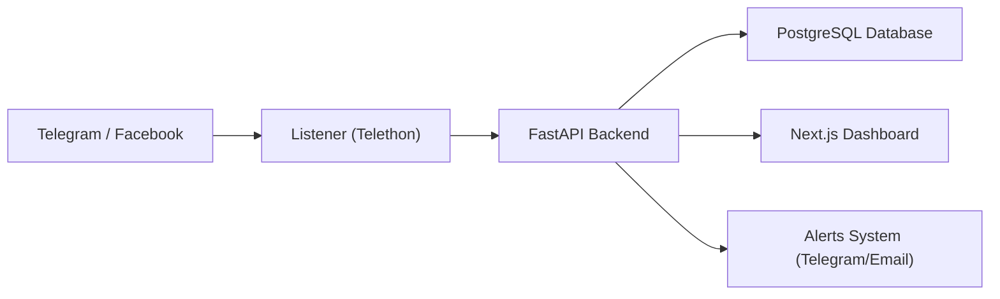

# 🛡️ Guard – AI Racism Prevention System

> AI-powered tool to detect racist and hate speech content (focused on Amharic & English) from social media platforms.

---

##  Overview
**Guard** is an open-source project designed to automatically identify and monitor racist or hateful speech in Amharic and English.  
It helps moderators and researchers track toxic trends, moderate online discussions, and build a safer digital environment.

---

##  Purpose
-  Detect offensive Amharic and English content  
- Support social media monitoring (starting with Telegram)  
-  Provide real-time alerts for flagged content  
-  Offer dashboards for trend analytics  

---

##  Tech Stack

| Layer | Technology |
|--------|-------------|
| **AI Model** | Davlan/xlm-roberta-base-amharic-sentiment |
| **Backend** | Python + FastAPI |
| **Database** | PostgreSQL |
| **Frontend** | Next.js + TailwindCSS |
| **Social Integration** | Telegram API via Telethon |
| **Deployment** | Docker Compose |
| **Version Control** | Git + GitHub |

---

##  Architecture Diagram




##  Folder Structure

```
guard/
│
├── backend/
│   ├── ai/               # AI model integration
│   ├── api/              # FastAPI routes
│   ├── db/               # Database models
│   ├── utils/            # Telegram alerts or helpers
│   ├── main.py           # Entry point
│   └── requirements.txt
│
├── dashboard/            # Next.js + Tailwind frontend
├── telegram_listener/    # Telethon listener for Telegram
├── docs/                 # Documentation files
├── docker-compose.yml
└── README.md
```

---

## ⚙️ Installation & Setup

### 🧩 1. Clone the Repository
```bash
git clone https://github.com/yourusername/guard.git
cd guard
```

### 🧰 2. Install Requirements
#### Backend:
```bash
cd backend
python -m venv venv
venv\Scripts\activate
pip install -r requirements.txt
```

Run backend server:
```bash
uvicorn main:app --reload
```

Check it at 👉 [http://127.0.0.1:8000](http://127.0.0.1:8000)

---

#### Frontend:
```bash
cd dashboard
npm install
npm run dev
```
Open browser at 👉 [http://localhost:3000](http://localhost:3000)

---

#### Database (with Docker):
```bash
docker run --name guard-db -e POSTGRES_PASSWORD=guard123 -p 5432:5432 -d postgres
```

Or start the full stack with:
```bash
docker-compose up -d
```

---

## 📡 Telegram Integration

1. Go to [my.telegram.org](https://my.telegram.org) → Get your **API ID** and **API Hash**  
2. Add them into `telegram_listener/config.py`:
   ```python
   api_id = "YOUR_API_ID"
   api_hash = "YOUR_API_HASH"
   ```
3. Run listener:
   ```bash
   python telegram_listener/listener.py
   ```

---

##  AI Model
The AI uses [Davlan/xlm-roberta-base-amharic-sentiment](https://huggingface.co/Davlan/xlm-roberta-base-amharic-sentiment).  
You can test it manually:
```python
from transformers import pipeline
analyzer = pipeline("text-classification", model="Davlan/xlm-roberta-base-amharic-sentiment")
print(analyzer(" "))
```

---

##  Documentation

- [`docs/PROJECT_DESCRIPTION.md`](./docs/PROJECT_DESCRIPTION.md)
- [`docs/SETUP_GUIDE.md`](./docs/SETUP_GUIDE.md)

---

##  Roadmap

- [ ] Phase 1: Backend Setup  
- [ ] Phase 2: AI Model Integration  
- [ ] Phase 3: Database Connection  
- [ ] Phase 4: Telegram Listener  
- [ ] Phase 5: Dashboard UI  
- [ ] Phase 6: Alerts & Analytics  
- [ ] Phase 7: Docker Deployment  

---


v